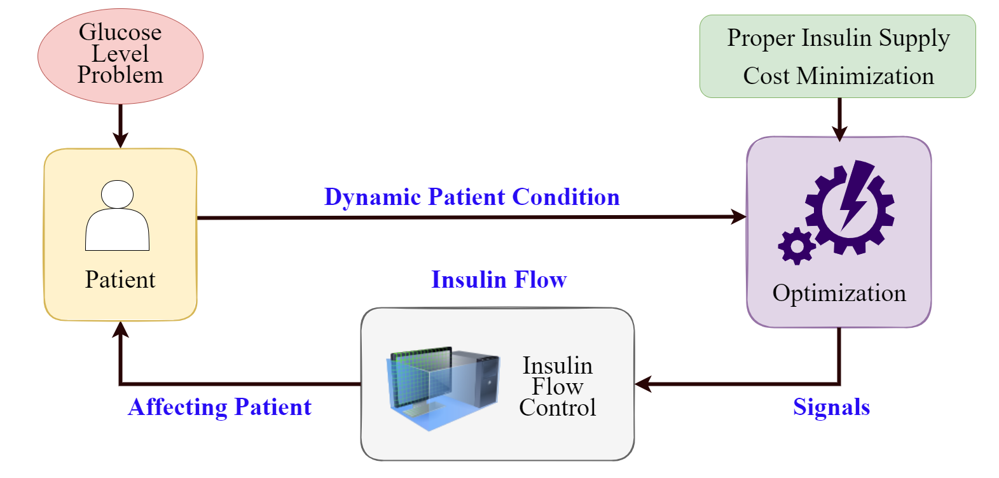
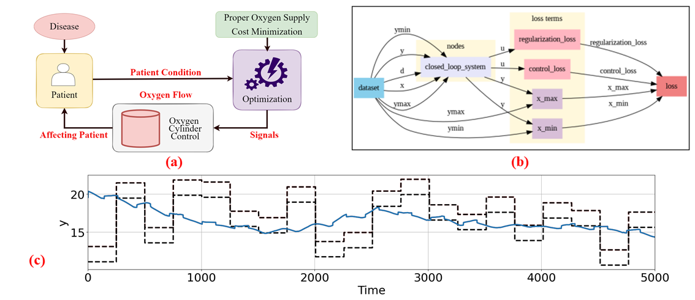

# ***NeuralCGMM*: Neural Control System for Continuous Glucose Monitoring and Maintenance**
- **Authors:** Azmine Toushik Wasi
- **OpenReview**: https://openreview.net/forum?id=Te4P3Cn54g
- **arXiv**: https://arxiv.org/abs/2402.13852

---
**Abstract:** Precise glucose level monitoring is critical for people with diabetes to avoid serious complications. While there are several methods for continuous glucose level monitoring, research on maintenance devices is limited. To mitigate the gap, we provide a novel neural control system for continuous glucose monitoring and management that uses differential predictive control, NeuralCGMM. Our approach, led by a sophisticated neural policy and differentiable modeling, constantly adjusts insulin supply in real-time, thereby improving glucose level optimization in the body. This end-to-end method maximizes efficiency, providing personalized care and improved health outcomes, as confirmed by empirical evidence.

## Architecture
 Pipeline of *NeuralCGMM*.

<p align="center">
  
</p>


<p align="center">
  
</p>


---

## Citation
```
@inproceedings{
wasi2024neural,
title={Neural Control System for Continuous Glucose Monitoring and Maintenance},
author={Azmine Toushik Wasi},
booktitle={The Second Tiny Papers Track at ICLR 2024},
year={2024},
url={https://openreview.net/forum?id=Te4P3Cn54g}
}
```
